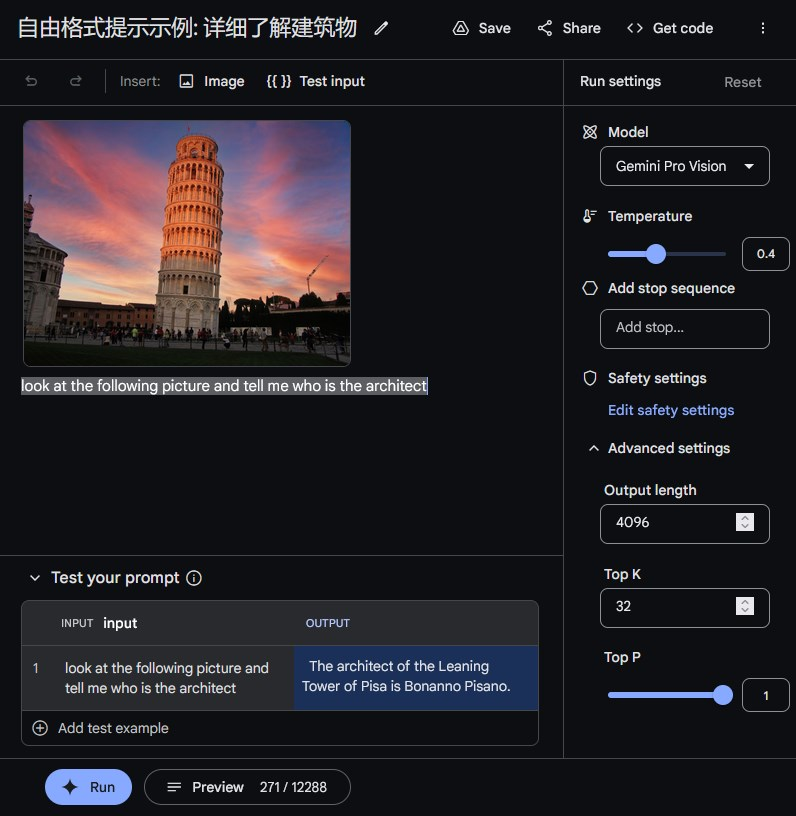

# Google AI Studio 快速入门

[Google AI Studio](https://makersuite.google.com/?hl=zh-cn) 是一款基于浏览器的 IDE，用于使用生成模型进行原型设计。通过 Google AI Studio，您可以快速试用模型并试验不同的提示。构建好满意的功能后，您可以将其导出为您偏好的编程语言（由 [Gemini API](python_quickstart.ipynb) 提供支持）编写代码。

<!--  -->

```{figure} ../statics/ais-app.png
主界面
```

## 提示和模型调整
Google AI Studio 提供了多种针对不同使用场景设计的提示界面：

- **自由格式提示** - 这些提示提供开放式提示体验，可用于生成内容以及对说明的响应。您可以同时使用图片和文本数据来提交提示。[了解详情-自由格式提示示例：详细了解建筑物](freeform_example)

- **结构化提示** - 这种提示方法可以通过提供一组示例请求和回复来指导模型输出。当您需要更好地控制模型输出的结构时，请使用此方法。[了解详情-结构化提示示例：构建商品文案生成器](structured_example)

- **聊天提示** - 使用聊天提示打造对话体验。 这种提示方法允许多次输入和响应轮流来生成输出。[了解详情-聊天提示示例：构建自定义聊天应用](chat_example)

通过 Google AI Studio，您还可以使用一种称为“调整”的技术来更改模型的行为：

- **经调整的模型** - 使用此高级技术提供更多示例，从而改进模型针对特定任务的响应。请注意，调整仅适用于旧版 PaLM 模型。在**设置**中开启**显示旧版模型**选项以启用此提示。 了解详情

(freeform_example)=
## 自由格式提示示例：详细了解建筑物
Gemini 的多模态功能可让您结合使用图像和文本来提示模型。例如，您可以使用此功能详细了解图片中显示的建筑物。
### 第1步：使用文本和图片创建提示
如需创建多模态提示，请执行以下操作：
1. 进入 [Google AI Studio](https://makersuite.google.com/?hl=zh-cn)。
2. 在左侧面板中，依次选择**新建** > **自由格式提示**。
3. 在右侧列的**模型**字段中，选择支持图像的模型，例如 **Gemini Pro Vision** 模型。
4. 在提示文本区域中，输入以下文本：
```
look at the following picture and tell me who is the architect
```
5. 从提示区域上方的**插入**栏中，选择**图片**，然后选择某个建筑物的示例图片。
6. 在应用窗口的底部，选择 **Run** 以生成此请求的回复。
<!--  -->
```{figure} ../statics/freeform_example.jpg
:name: freeform_example-ref

自由格式提示 样例效果图
```

### 第2步：在提示符中添加可替换的变量
在第 1 步中，您使用固定的文本字符串和图像提示模型。但有时，您希望能够动态更改提示的某些部分。例如，如果您要构建交互式应用，可能需要使用不同的用户输入来修改提示。为此，您可以使用变量将提示参数化。  

<!--  -->
```{figure} ../statics/add_variable.png
添加变量
```

如需向提示添加变量，请执行以下操作：  
1. 选择要在问题中替换的字词或短语。在本例中，请选择文本：`who is the architect`。
2. 从提示上方的 **Insert:** 标头中，选择 **`&lcub;&lcub; &rcub;&rcub; Test input`**。
3. 在提示下方的 **Test your Prompt** 表格中，为您的提示添加一个额外的值，方法是选择 **Add test example** 并输入额外的提示值。您可以随意添加几个新的输入值。
4. 在应用窗口的底部，选择 **Run** 以为每个不同的请求生成回复。


### 第3步：用模型参数进行实验
在对提示进行原型设计时，您还可以在应用右侧试用模型运行设置。以下是需要了解的关键设置：

- **模型** - 选择您要回答问题的模型。 如需详细了解可用的模型和功能，请参阅[模型](./models/models_index.md)。
- **温度** - 控制模型响应可以允许多大程度的随机性。提高此值可让模型生成更意外且更- 创造性的响应。
- **最大输出** - 增加模型为每个请求返回的响应数。此选项能够针对单个提示生成多个- 应，有助于快速测试提示。
- **Safety settings** - 调整用于管理模型响应的安全设置。如需详细了解这些控制措施- 请参阅[安全设置](safety_setting_gemini.md)。

### 第4步：后续步骤
现在，您已经为生成式 AI 应用设计了原型，接下来可以保存您的工作或生成代码，以便在您自己的开发环境中使用此提示。

如需保存您创建的提示，请执行以下操作：

1. 在 Google AI Studio 应用的右上角，选择**保存**。
2. 如果您尚未将应用关联到您的 Google 云端硬盘帐号，请执行此操作。
3. 在**保存提示**对话框中，输入**提示名称**和可选的**说明**，然后选择**保存**。

如需将您创建的提示以代码的形式导出，请执行以下操作：

1. 在 Google AI Studio 应用的右上角，选择**获取代码**。
2. 选择一个编程语言标签页。
3. 选择**复制**以将此代码复制到剪贴板。

```{warning}
注意：您需要使用 API 密钥才能在 Google AI Studio 之外运行提示代码，因此请务必创建一个密钥，并将其包含在提示代码中。  
注意：请将 API 密钥视为密码并妥善保护。请勿将您的密钥嵌入到公开发布的代码中。
```

(structured_example)=
## 结构化提示示例：构建商品文案生成器
到目前为止，您已经了解了如何使用指令（“看图片，告诉我架构师是谁”）来提示模型。但是，有时，您可以通过结合说明和示例来向模型发出提示，从而获得更好的结果。Google AI Studio 中的结构化提示可帮助您做到这一点 - 将指令与示例相结合，向模型显示您想要的输出类型，而不是仅仅指示模型要执行什么操作。如果您希望模型保持一致的输出格式（即结构化 json）或难以描述模型的具体风格，这种提示非常有用。在本部分中，您将了解如何在 Google AI Studio 中创建结构化提示。
```{tip}
注意 ：您可以直接在 Google AI Studio 中从[示例库](https://ai.google.dev/examples?keywords=prompt&hl=zh-cn)中尝试此示例。
```
### 第1步：构建结构化提示
在此示例中，您将创建一个结构化提示，用于为产品生成广告文案。首先，您需要创建两列（Product 输入列和 Product copy 输出列）来定义提示的结构。

<!--  -->
```{figure} ../statics/structured_prompt.png
添加结构化提示
```


如需创建结构化提示，请执行以下操作：

1. 在 [Google AI Studio](https://makersuite.google.com/?hl=zh-cn) Web 应用的左上角，依次选择**新建** > **结构化提示**。
2. 在 **Insert:** 标头下方，添加结构化提示的说明：
```text
You are a product marketer targeting a Gen Z audience. Create exciting and
fresh advertising copy for products and their simple description. Keep copy
under a few sentences long.
```
3. 通过将默认的 `input`: 文本说明替换为 `Product:`，为 **INPUT** 添加描述性标题。
4. 通过将默认的 `output`: 文本说明替换为 `Product copy:`，为 **OUTPUT** 添加描述性标题。
```{tip}
提示 ：在列名称末尾添加英文冒号，以便模型更轻松地解析结构。
```
### 第2步：添加示例
提供一些示例行。这些行应包含示例输入（本例中的产品名称）和示例输出（对应的产品说明）。通过为模型提供几个示例产品说明，可以指导模型在生成自己的输出时复制类似的风格。可以手动输入示例，也可以使用“导入数据”菜单从文件导入。

要手动输入**示例**，请执行以下操作：
1. 在顶部的**示例**数据表中，选择 **Product:** 标题下方的字段，然后输入产品说明。
2. 选择 **Product copy:** 标题并输入该产品的营销文案。
以下示例展示了此提示的输入和输出值：

| 产品：|  	产品文案：|
| --- | ---|
| Old-school sneaker | Let's lace up! These kicks bring an iconic look and a one of a kind color palette, while supporting you in style and function like no other shoe before. |
| Supersoft hoodie | Stay cozy and stylish in our new unisex hoodie! Made from 100% cotton, this hoodie is soft and comfortable to wear all day long. The semi-brushed inside will keep you warm on even the coldest days.|

```{tip}
提示 ：如果您让作者屏蔽或者没有示例产品文案示例，则可以使用自由格式提示让文本模型为您生成一些示例。
```
如需从文件导入示例，请执行以下操作：
1. 在**示例**表的右上角，依次选择**操作 > 导入示例**。
2. 在对话框中，选择 Google 云端硬盘中的 CSV 或 Google 表格文件，或者从计算机上传。
3. 在“导入示例”对话框中，选择要导入的列，要排除哪些列。通过该对话框，您还可以在结构化提示中指定将哪个数据列导入哪个表列。
### 第3步：测试提示
准备好向模型显示所需内容的示例后，在底部的**测试您的提示**表中使用新输入来测试提示。与文本提示类型一样，您可以调整模型参数，以测试这些参数是否有助于为您的使用场景生成更好的结果。
查看如何将样本发送到模型

从本质上讲，Google AI Studio 会将指令与您提供的示例相结合来构建提示。随着您添加更多样本，这些样本会添加到发送给模型的文本中。根据样本的长度，您可能会开始达到模型的词元限制。所有生成式 AI 模型都有令牌限制，即它们可以接受作为输入的文本的最大长度。

如需查看提示的完整内容，请执行以下操作：
- 选择 Google AI Studio Web 应用底部的**文本预览**。

```{figure} ../statics/structured_prompt_result.jpg
结构化提示示例 效果图
```

```{tip}
注意 ：模型令牌限制显示在预览窗格底部。
```
### 第4步：后续步骤
如果对提示感到满意，可以点击**获取代码**按钮将其**保存**或导出到代码中。

您还可以将各个少样本样本导出到 CSV 文件或 Google 表格中。选择**操作**菜单下的**导出示例**选项以导出您的示例。

(chat_example)=
## 聊天提示示例：构建自定义聊天应用
如果您使用过 [Bard](https://blog.google/technology/ai/bard-google-ai-search-updates/?hl=zh-cn) 等通用聊天机器人，就能亲身体验生成式 AI 模型在开放式对话方面的强大之处。虽然这些通用聊天机器人非常有用，但它们通常需要针对特定使用场景进行定制。例如，您可能希望构建一个客户服务聊天机器人，它仅支持有关公司产品的对话的对话。您可能需要构建一个使用特定语气或风格的聊天机器人：一个可以讲大量笑话、像诗人押韵的机器人，或在回答中使用大量表情符号。

<!--  -->
```{figure} ../statics/chat_prompt.png
构建聊天提示
```

此示例展示了如何使用 Google AI Studio 构建一个友好的聊天机器人，它就像是居住在木星的一颗卫星“欧罗巴”上的外星人一样进行沟通。

### 第1步：创建聊天提示
在上一部分中，您设计了使用输入和输出示例组合的结构化提示。同样，如需构建聊天机器人，您需要提供用户和聊天机器人之间的互动示例，以指导模型提供您需要的响应。

如需创建聊天提示，请执行以下操作：

1. 在 Google AI Studio Web 应用的左上角，依次选择**新建 > Chat 提示**。

2. 在提示界面的**编写提示示例**列中，您可以开始提供互动示例。您还可以在第一个示例中提供其他上下文，例如：
```text
User:  You are Tim, a friendly alien that lives on Europa, one of
Jupiter's moons.
Model: Ok
```
3. **User** 和 **Model** 字段中提供了用户和聊天机器人之间的互动示例：
```text
User: Hi!
Model: Hi! My name is Tim and I live on Europa, one of Jupiter's moons. Brr!
It's cold down here!
```
填写完示例后，通过在聊天提示界面的右侧窗格中与模型聊天来开始测试您的应用。

如需测试聊天机器人的行为，请执行以下操作：

1. 在**测试提示面板**中，选择底部的输入字段。
2. 输入用户可能提出的问题或观察结果，例如：
```
What's the weather like?
```
3. 选择输入字段右侧的菱形按钮，以获取聊天机器人的响应，响应可能如下所示：
```
Model: The weather on Europa is very cold and icy. ...
```
### 第2步：训练聊天机器人更好地聊天
通过提供一个语句和响应示例，您可以构建一个基本的欧罗巴外星聊天机器人。但是，单个样本通常不足以确保模型响应的一致性和质量。如果没有进一步输入，模型对天气相关问题的回答往往会很长，听起来像是教科书里的回答，而不是友好的外星人给出的回答。

使用模型响应并对其进行修改，以匹配外星聊天机器人所需的语气和风格，从而自定义聊天机器人的语气。

<!--  -->
```{figure} ../statics/add_example.png
添加样例
```


如需添加和修改聊天机器人定义的示例，请执行以下操作：
1. 在 **Test yourPrompt** 面板中，将光标悬停在 **User** 标题的左侧，然后选择 **Add to examples** 按钮。
2. 在**编写提示示例**列中，修改复制的输入和响应，以匹配聊天机器人的预期风格和语气。

您可以使用此方法添加更多示例。提出更多问题、修改答案，并提高聊天机器人的质量。继续添加示例，并测试这些示例会如何修改聊天机器人的行为。通常，示例越多，聊天机器人响应的质量越高。

在后台，Google AI Studio 会通过组合以下各项来构建提示：

- 对话框示例
- 对话记录

文本块传递给模型。如需查看完整的提示是什么样子，请点击屏幕底部的 **Preview**，以调出预览窗格。

请注意，由于模型与用户之间的每条消息都包含在提示中（这就是“对话记录”），因此对话提示可能会随着对话的进行而增长。最终，您可能会达到模型的词元限制，即模型可以接受的文本长度上限。您可以在**预览**标签页中查看完整的对话和令牌数量。

### 第3步：用模型参数进行实验
还可以尝试调整模型参数，以查看它们是否为您的使用场景生成了更合适的结果。
### 第4步：后续步骤
与其他提示类型类似，一旦对提示的原型设计符合您的要求，您就可以使用**获取代码**按钮开始编写代码，或保存提示，以便稍后处理并与他人分享。

## 深入阅读
- 如果您已准备好继续编写代码，请参阅 [API 快速入门](python_quickstart.ipynb)。
- 如需了解如何撰写更好的提示，请参阅[提示设计准则](prompt_best_practices.md)。

