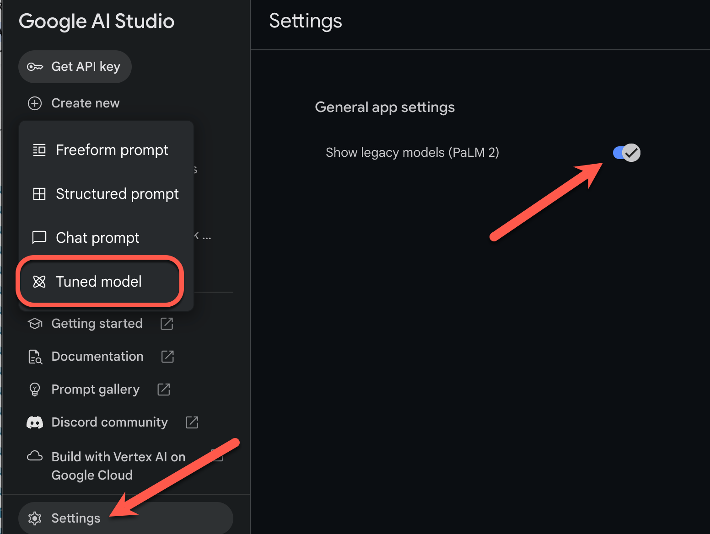

# 模型微调指南
提示设计策略（例如，少样本提示）不一定总能产生您需要的结果。如果指令不足，并且您有一组演示您所需输出的示例，则可使用模型调整来提高模型在特定任务上的性能，或帮助模型遵循特定的输出要求。

本页面提供了有关如何调整 PaLM API 文本服务背后的文本模型的指导。
```{tip}
注意 ：目前，调整仅适用于 text-bison-001 模型。
```
## 模型微调的工作原理
模型调整的目标是进一步提高模型针对特定任务的效果。模型调整的工作原理是为模型提供包含许多任务样本的训练数据集。对于特定领域任务，您可以使用适量样本调整模型，以此来显著提高模型的效果。

您的训练数据应采用输入和输出样本对的结构。您还可以直接在 Google AI Studio 中使用 CSV 或电子表格文件调整模型。目标是训练模型模仿预期行为或任务，方法是提供多个示例来说明该行为或任务。

当您运行调整作业时，模型会学习其他参数，帮助其对执行所需任务或学习预期行为所需的必要信息进行编码。这些参数随后可在推断时使用。调整模型的输出是一个新模型，实际上是新学习的参数和原始模型的组合。

## 支持的模型
以下基础模型支持模型微调：
- `text-bison-001`


## 模型微调的工作流
模型微调工作流如下所示：
1. 准备数据集
2. 如果你使用的是MarkrSuiter，请导入数据集
3. 启动微调作业

模型微调完成后，将显示调整后的模型的名称。您也可以在 Google AI Studio 中将其选为创建新提示时要使用的模型。
```{tip}
注意 ：如需在 Google AI Studio 中启用模型调整，请在设置中启用显示旧版模型选项。然后，您可以依次选择新建 > 经调整的模型，创建经调整的模型。
```

## 准备数据集
在开始调整之前，您需要一个用于调整模型的数据集。为获得最佳性能，数据集中的样本应为高质量、多样化且能够代表真实输入和输出的样本。
### 形式
数据集中包含的样本应与您的预期生产流量相匹配。如果您的数据集包含特定的格式、关键字、说明或信息，则生产数据应以相同方式设置格式并包含相同的说明。

例如，如果数据集中的样本包含 "question:" 和 "context:"，则生产流量的格式也应设置为包含 "question:" 和 "context:"，其顺序与在数据集样本中的显示顺序相同。如果排除上下文，模型将无法识别模式，即使确切问题存在于数据集中的样本中也是如此。

为数据集中的每个样本添加提示或前导码也有助于提升经调整的模型的性能。请注意，如果您的数据集内包含提示或前言，则在推断时，它也应包含在调整后的模型的提示中。
### 推荐尺寸
您可以使用相对较小的数据集调整模型。您应该借助 100 多个示例来获得更好的结果。下表显示了针对各种常见任务调整文本模型的建议数据集大小：

|任务 |	数据集中的样本数|
|---|---|
|分类 |	超过 100 个|
|摘要 |	100-500+|
|文档搜索 	|超过 100 个 |

## 上传调整数据集
数据可以通过 API 以内嵌方式传递，也可以通过在 Google AI Studio 中上传的文件进行传递。调整完成后，系统会删除上传到 Google AI Studio 的文件。 

使用**导入**按钮从文件导入数据，或选择包含示例的结构化提示将导入为调整数据集。

**客户端**

要使用该客户端库，请在 createTunedModel 调用中提供数据文件。文件大小上限为 4MB。如需开始使用，请参阅[快速入门：使用 Python 进行调优](tuning_quickstart_python_palm.ipynb)。

**Curl**
如需使用 Curl 调用 REST API，请向 training_data 参数提供 JSON 格式的训练示例。如需开始使用，请参阅[快速入门：使用 Curl 进行调优]()【编写中】。

## 创建模型调整作业
创建调整作业时，您可以指定以下超参数：

- 周期 - 整个训练集的完整训练遍历，以便每个样本只处理一次。
- 批次大小 - 一次训练[迭代](https://developers.google.com/machine-learning/glossary?hl=zh-cn#iteration)中使用的一组样本。批次大小决定了一个批次中的样本数量。
- 学习速率 - 一个浮点数，告知算法在每次迭代时调整模型参数的强度。例如，0.3 的学习速率调整权重和偏差的威力是 0.1 的 3 倍。高学习速率和低学习速率具有各自的独特权衡，应根据您的用例进行调整。

### 建议的配置
下表显示了调整基础模型的建议配置：
|超参数 |	默认价值 |	建议的调整|
|---|---|
|纪元 |	10 	|如果损失在 10 个周期之前开始稳定，请使用较小的值。<br>如果损失趋于收敛，并且似乎未趋于稳定，请使用较高的值。|
|批次大小 |	16 	||
|学习速率 	|2 亿 - 2 	|对于较小的数据集，请使用较小的值。|

损失曲线显示每个周期之后，模型的预测与训练样本中的理想预测的偏差程度。理想情况下，您希望在曲线进入平稳状态之前，在曲线的最低点停止训练。例如，下图显示了损失曲线在周期 4 到 6 左右趋于稳定，这意味着您可以将周期参数设置为 4，并且仍然可以获得相同的性能。
## 检查调整作业状态

您可以在 Google AI Studio 界面的**我的库**标签页下查看调整作业的状态，也可以使用 PaLM API 中调整后模型的 metadata 属性来查看调整作业的状态。

## 排查错误
本部分提供了有关如何解决在创建经调整的模型时可能会遇到的错误的提示。

### 身份验证
使用 API 和客户端库进行调整需要用户身份验证。仅有 API 密钥是不够的。如果看到 `'PermissionDenied: 403 Request had insufficient authentication scopes' `错误，您需要设置用户身份验证。

如需为 Python 配置测试 OAuth 凭据，请参阅[OAuth 设置教程](oauth_quickstart.md)。
### 已取消的模型
在模型调整作业完成之前，您可以随时取消该作业。但是，取消模型的推断性能是不可预测的，尤其是在训练早期取消调优作业的情况下。如果您因为想在较早的周期停止训练而取消操作，则应创建新的调整作业并将周期设置为较低的值。
## 后续步骤
- 了解[Responsible AI 最佳实践](safety_guidance.md)。
- 如需开始使用，请参阅[快速入门：使用 Python 进行调优](tuning_quickstart_python_palm.ipynb)或[快速入门：使用 Curl 进行调优]()【编写中】。
