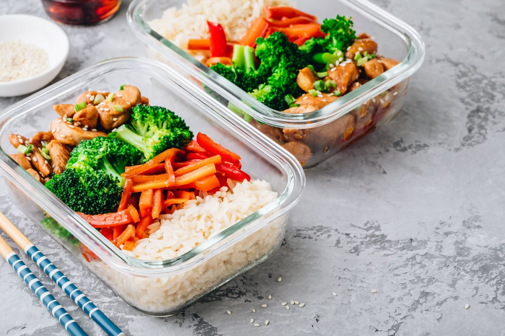
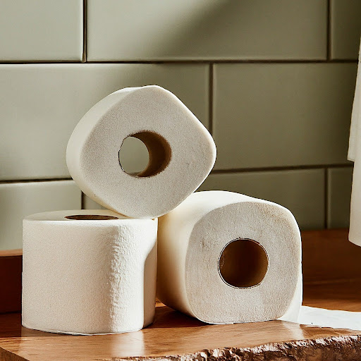
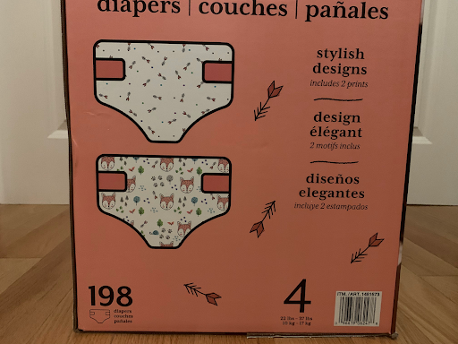

# 多模态概念
Gemini 是针对多模态用例构建的一系列模型。

多模态模型是一种能够处理来自多种模态（包括图像和文本）的信息的模型。例如，您可以向模型发送一张美味佳肴的照片，让其撰写一篇关于此菜的短博客。

| 提示     | 回答      |实际回答      |
| -------- | --------- | --------- |
| 根据这张图片写一篇引人入胜的简短博文。照片中应包含对膳食的描述，并谈论我的膳食准备历程。 |备餐可以为您节省时间和金钱，而且还有助于您吃得更健康。这顿饭是健康美味的一餐很好的例子，可以轻松地提前准备好。<br> 这道餐点包括糙米、烤蔬菜和照烧鸡。 糙米是一种健康且复杂的碳水化合物，可以为您提供持续的能量。烤蔬菜是获取每日维生素和矿物质的好方法，而照烧鸡则是一种美味且富含蛋白质的食物。  <br>这道菜也非常容易准备。只需先烹煮棕米，烤蔬菜，然后烹制照烧鸡。准备好所有菜品后，将其放入备餐容器中，然后存储在冰箱中。 然后，您可以找一个容器，完成忙碌的早晨！  <br>想要提前准备的又健康又美味的餐点，那么这顿饭是个不错的选择。它富含各种营养成分和口味，定能给您提供饱腹感。<br>准备健康又美味的餐食吧！|大家好！今天我想和大家分享一下我的膳食准备历程。我一直都很喜欢烹饪，但我总是觉得做饭很花时间。所以我决定尝试一下膳食准备，看看是否能节省时间。<br>我开始做饭的时候，我总是会做一大堆，然后把剩下的食物冷冻起来。这样我就可以在以后的某个时候吃，而不必再做饭了。但问题是，我经常会忘记我把什么冷冻了，或者我不想吃我冷冻的食物。|


## 多模态模型
**Gemini** 是 Google DeepMind 开发的一系列生成式 AI 模型，专为多模态使用场景而设计。借助 Gemini API，您可以访问`gemini-pro-vision`和`gemini-pro`模型。如需了解 Gemini API 模型的规范，请参阅[模型信息](./models/models.md)。

## 多模态提示
借助 Gemini API，您可以向 Gemini 模型发送多模态提示。支持的模态包括文本和图片。

如需获取常规提示设计指导，请参阅[提示设计策略](prompt_best_practices.md)。


## 支持的模型
以下模型支持多模态提示响应。
`gemini-pro-vision`


## 多模态提示最佳实践
可以按照以下最佳实践改进多模态提示：  
[提示设计基础知识](fundamentals)
- 说明要具体：写出清晰简明的说明，尽量避免误解。
- 在提示中添加几个示例：使用切实可行的少样本示例来说明您想实现的目标。
- 逐步细分：将复杂的任务划分为多个易于管理的子目标，引导模型完成整个过程。
- 指定输出格式：在提示中，要求输出采用您想要的格式，例如 Markdown、JSON、HTML 等。
- 针对单图提示将图片放在前面：虽然 Gemini 可以按任意顺序处理图片和文本输入，但对于包含单张图片的提示，如果将其放在文本提示之前，可能会取得更好的效果。 

[排查多模态提示问题](troubleshooting)
- 如果模型没有从图片的相关部分绘制信息：添加提示，说明您希望提示从图片的哪些方面提取信息。
- 如果模型输出过于宽泛（未针对图片量身定制）： 在提示的开头，尝试要求模型描述图片，然后再提供任务说明，或者尝试让模型引用图片中的内容。
(fundamentals)=
## 提示设计基础知识
### 说明要具体

清晰、详尽的提示效果最好。如果您有特定的输出，最好在提示中包含该要求，以确保获得所需的输出。

有时，提示的编写者可能看上去很清楚，但实际上并没有明确。如需自定义模型行为，请考虑您的提示可能被误解（误解），并确保您提供的说明具体而清晰。务必尽量避免误解

对于此机场登机牌图片，要求模型仅“描述此图片”可以生成一般描述。如果您需要模型解析图片中的时间和城市，您可以直接在提示中包含该请求。

| 提示     | 预计回答      |实际回答      |
| -------- | --------- | --------- |
| 描述这张图片。| 此图片显示了机场到达和出发信息面板。| 这是机场出发航班信息显示屏，显示了从该机场出发的航班的目的地、出发时间和到达时间。 |

| 更新后的提示     | 预计回答      |实际回答      |
| -------- | --------- | --------- |
| 将图中所示的机场信息板中的时间和城市解析成一个列表。|10:50 莫斯科<br>11:05爱丁堡<br>11:05伦敦<br>11:10布加勒斯特<br>11:30 基辅<br>11:35 都柏林<br>11:45 东米德兰兹<br>12:15 索非亚<br>12:30 伦敦<br>12:30 纽卡斯尔<br>12:40 圣彼得堡<br>12:40 伦敦<br>12:45 曼彻斯特| 一样。略 |

### 添加一些示例
Gemini 模型可以接受多个输入，以用作示例来了解您想要的输出。添加这些样本有助于模型识别模式，并将指定图片和响应之间的关系应用于新样本。这也称为“少样本”学习。

在以下示例中，初始输出以句子形式编写，并且还包含国家/地区（巴西）。假设您希望输出采用其他格式或样式，并且只需要城市，而不想要国家/地区。在提示中添加少样本样本可以引导模型以您想要的方式响应。


| 提示     | 预计回答      |实际回答      |
| -------- | --------- | --------- |
|确定城市和地标。|地标建筑是巴西里约热内卢的基督救世主雕像。 |里约热内卢，巴西，基督救世主像|

| 更新后的提示     | 预计回答      |实际回答      |
| -------- | --------- | --------- |
|确定城市和地标。城市：罗马 ，地标：罗马斗兽场。城市：北京，地标：紫禁城| 城市：里约热内卢，地标：基督救世主雕像 |城市：里约热内卢，地标：基督像|

### 分步解析

对于像需要视觉理解和推理这样的复杂任务，将任务拆分为更小、更简单的步骤会很有帮助。或者，如果你在提示中直接要求模型“一步步思考”，也可以有效地解决问题。

| 提示     | 预计回答      |实际回答      |
| -------- | --------- | --------- |
|我什么时候会用完卫生纸？|很快，你只剩 3 点掷骰子了。|当只剩下最后一卷卫生纸时。|

| 更新后的提示     | 预计回答      |实际回答      |
| -------- | --------- | --------- |
|    1. 首先，数一下这张图片中的卫生纸卷数量。2. 然后，确定一般人每天会使用多少卫生纸。3. 计算这些厕纸卷可以用多长时间。|    1. 这张图片中有 3 卷卫生纸。2. 一般人每天会使用大约 20 张卫生纸。3. 如果每个纸卷包含 200 张纸，则每个纸卷将持续 10 天左右。因此，这 3 个掷骰结果将持续大约一个月。|  1. 3；2. 1卷；3. 3天 |
```{tip}
数学题或其他类型的文字题非常适合要求模型分步思考。
```
### 尝试指定输出格式
一个常见问题是，模型输出需要采用某种格式（例如 Markdown、JSON、HTML），尤其是在模型输出需要由下游任务提取时。您可以尝试在提示中指示模型生成该格式的输出。以下是两个示例：
```
将此图片中的表解析为 Markdown 格式
```
```
请提供以下所有属性的列表：

食材、菜系类型、是否是素食（采用 JSON 格式）
```

### 针对单图提示，将图片放在前面
虽然 Gemini 可以在提示中以任何顺序解释图片和文本，但在文本提示之前放置一张图片可能会获得更好的结果。在以下示例中，您会注意到图片显示在每个提示中的文本之前。

(troubleshooting)=
## 排查多模态提示问题

如果您没有收到有用的响应，则可能需要对提示进行问题排查。您可以尝试以下这些策略。

### 如果模型不是从图片的相关部分绘制信息

为了获得更具体的响应，您可以指出您希望提示从图片的哪些方面获取信息来作为响应。

| 提示     | 预计回答      |实际回答      |
| -------- | --------- | --------- |
|How many days will these diapers last a baby?|The diapers will last for 198 days before they run out.|  This box of diapers has 198 diapers. If a baby uses 8 diapers a day, the diapers will last 24.75 days. |


| 修改过的提示     | 预计回答      |实际回答      |
| -------- | --------- | --------- |
|How long will these diapers last before I run out?Use the weight shown on the box to determine the child's age, and use the total number of diapers in the box.Divide the total number by how many diapers the child goes through per day.|The box contains 198 diapers. The box states the diapers are for a child weighing 22-37 lbs.The average child in this weight range is likely between 1 and 2 years old.A 2-year-old typically goes through 6 diapers per day, therefore, the diapers will last around 33 days (198/6).|   The box states the diapers are for a child weighing 22-27 lbs. The average 25 lb child goes through 8-10 diapers per day. With 198 diapers in the box, they will last 19-24 days.  |


### 如果模型输出过于宽泛，并且未针对图片输入量身定制
为了帮助模型定制其对图片的响应，在执行推理任务之前，请尝试让模型对图片进行描述。


还可以尝试明确要求模型引用图片中的内容。


同样的提示也适用于基于图片的广告素材输出。在下面的兔子示例中，明确要求模型包含图片的各个方面可以提高输出。


### 排查提示失败的哪个部分

很难知道提示是因模型开始无法理解图片而失败，还是在理解图片之后没有执行正确的推理步骤。

为区分这些原因，请让模型描述图片中的内容。

在下面的示例中，如果模型在响应时提供与茶搭配的零食（例如爆米花），则可以首先排查问题，以确定模型是否正确识别出图片包含茶。

另一种策略是让模型解释其推理。这有助于你缩小原因的哪一部分（如果有的话）。


### 调整采样参数
在每个请求中，您不仅需要向模型发送多模态提示，还要向模型发送一组采样参数。模型可以针对不同的参数值生成不同的结果。尝试使用不同的参数来获得任务的最佳值。最常调整的参数如下：
- 温度
- Top-P
- Top-K

**温度**

温度用于在响应生成过程中进行采样，这发生在应用了 Top-P 和 Top-K 时。温度可以控制词元选择的随机性。较低的温度适合需要更确定性和较不开放式或创造性响应的提示，而较高的温度可以产生更加多样化或更具创意的结果。温度为 0 表示确定性，即始终选择概率最高的回答。

对于大多数应用场景，不妨先试着将温度设为 0.4。如果您需要更具创意的结果，请尝试调高温度。如果您观察到明显的幻觉，请尝试调低温度。
**Top-K**
Top-K 可更改模型选择输出词元的方式。如果 Top-K 设为 1，表示下一个所选词元是模型词汇表的所有词元中概率最高的词元（也称为贪心解码）。如果 Top-K 设为 3，则表示系统将根据温度从三个概率最高的词元中选择下一个词元。

对于每个词元选择步骤，系统都会对概率最高的前 K 个词元进行采样。然后，系统会根据 Top-P 进一步过滤词元，并使用温度采样选择最终的词元。

指定较低的值可获得随机程度较低的回答，指定较高的值可获得随机程度较高的回答。 Top-K 的默认值为 32。
**Top-P**
Top-P 可更改模型选择输出词元的方式。系统会按照概率从最高（见 Top-K）到最低的顺序选择词元，直到所选词元的概率总和等于 Top-P 的值。例如，如果词元 A、B 和 C 的概率为 0.6、0.3、0.1，并且 Top-P 的值为 0.9，则模型将根据温度选择 A 或 B 作为下一个词元，并排除 C 作为候选词元。

指定较低的值可获得随机程度较低的回答，指定较高的值可获得随机程度较高的回答。 Top-P 的默认值为 1.0。

## 后续步骤
- 尝试使用 [Google AI Studio](http://makersuite.google.com/?hl=zh-cn)编写您自己的多模态提示。
- 如需更深入地了解提示设计，请参阅[提示策略](prompt_best_practices.md)主题。
