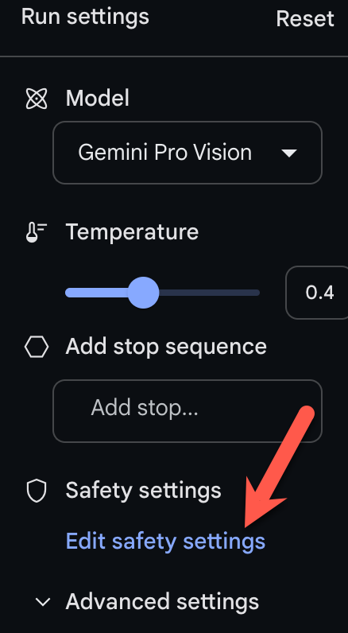
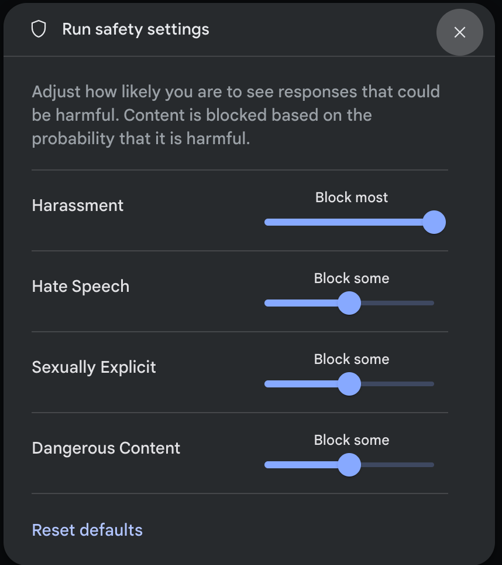

# 安全设置
本指南介绍了适用于 Genmini API 的可调整安全设置。在原型设计阶段，您可以在 4 个维度上调整安全设置，以快速评估应用需要增加还是减少配置限制。

默认情况下，安全设置会在所有 4 个维度上屏蔽可能属于中等和/或高等不安全内容的内容。此基准安全性设计适用于大多数用例，因此您应仅在应用一直需要调整安全设置时，再调整安全设置。

```{tip}
注意 ：调整到较低的安全设置将触发对您的应用进行更深入的审核流程。
```
## 安全过滤条件
除了可调整的安全过滤器之外，Gemini API 还内置了防范核心危害（例如危及儿童安全的内容）。这些类型的危害始终会遭到阻止且无法调整。

可调节的安全过滤器涵盖以下类别：

- 骚扰内容
- 仇恨言论
- 露骨色情
- 危险内容

这些设置使您（开发者）能够确定哪些设置适合您的用例。例如，如果您正在制作视频游戏对话，那么您认为允许添加更多因游戏性质而被评为危险内容的内容是可以接受的。下面是可能需要在这些安全设置中灵活运用一些其他用例的示例：

| 用例 | 类别|
|---| ---|
|反骚扰培训应用| 	仇恨言论、露骨色情内容|
|剧本作者| 	露骨色情、危险|
|恶意分类器 |	骚扰、危险内容 |

## 概率与严重程度

Gemini API 会根据内容不安全的概率而不是严重程度来屏蔽内容。请务必考虑这一点，因为即使危害的严重程度仍为较高，某些内容不安全的可能性也很低。例如，比较句子：

- 机器人打了我一拳。
- 机器人把我砍伤了。

句子 1 可能会导致不安全概率，但您可能会将句子 2 视为暴力内容的严重程度较高。

因此，每位开发者都必须仔细测试并考虑需要多高的屏蔽级别来支持其关键用例，同时尽可能减少对最终用户造成的影响。

## 安全设置
您向短信服务发送的请求中包含安全设置。您可以针对您向 API 发出的每个请求进行调整。下表列出了您可以设置的类别，并说明了每个类别涵盖的伤害类型。

|  显示文本|类别 |	说明|
| ---| --- | --- |
| Harassment|骚扰 |	针对身份和/或受保护特征发表的负面或有害评论。|
|Hate speech  |仇恨言论 |	粗俗、不雅或亵渎性的内容。|
| Sexually explicit |露骨色情 |	提及性行为或其他淫秽内容。|
|Dangerous |危险 |	宣扬、助长或鼓励有害行为。 |


您也可以在[API 参考文档](https://ai.google.dev/api/rest/v1beta/HarmCategory?hl=zh-cn)中查看这些定义。

下表介绍了您可以针对每个类别调整的屏蔽设置。例如，如果您针对**仇恨言论**类别将屏蔽设置设置为**屏蔽少量**，则所有很可能是仇恨言论内容的内容都会被屏蔽。但允许任何可能性较低的内容。

如果未设置此政策，则默认屏蔽设置是针对所有类别**屏蔽部分**。

| 阈值 (Google AI Studio)| 	阈值 (API) 	说明|
| --- | ---|
| 全部不屏蔽 |	BLOCK_NONE| 	始终显示（无论是否存在不安全内容的概率）|
| 屏蔽少部分 |	BLOCK_ONLY_HIGH |	在存在高风险的不安全内容时屏蔽|
| 屏蔽部分| 	BLOCK_MEDIUM_AND_ABOVE| 	出现中等或高概率的不安全内容时屏蔽|
| 屏蔽大部分 |	BLOCK_LOW_AND_ABOVE |	在存在不安全内容的几率较低、中等或较高时屏蔽|
|	|HARM_BLOCK_THRESHOLD_UNSPECIFIED |	未指定阈值，使用默认阈值进行屏蔽 |

您可以为向文本服务发出的每个请求设定这些设置。如需了解详情，请参阅[HarmBlockThreshold](https://ai.google.dev/api/rest/v1beta/SafetySetting?hl=zh-cn#HarmBlockThreshold)API参考文档。

## 安全反馈
如果内容被屏蔽，来自该 API 的响应会在[ContentFilter.reason](https://ai.google.dev/api/rest/v1beta/ContentFilter?hl=zh-cn)字段中包含被屏蔽的原因。如果原因与安全相关，则响应中还会包含 [SafetyFeedback](https://ai.google.dev/api/rest/v1beta/GenerateTextResponse?hl=zh-cn#SafetyFeedback)字段，其中包含用于该请求的安全设置以及安全评分。安全评分包括分类的类别和概率。系统不会返回被屏蔽的内容。
返回的概率对应于块置信度，如下表所示：
|概率 |	说明|
|---|---|
|NEGLIGIBLE |	内容不安全的可能性微乎其微|
|LOW |	内容不安全的可能性很低|
|MEDIUM |	内容不安全的可能性为中等|
|HIGH |	内容很有可能不安全 |

例如，如果内容因骚扰类别极高而被屏蔽，返回的安全评分的类别将设置为**HARASSMENT**，伤害概率会设置为 **HIGH**。

## Google AI Studio 中的安全设置

您还可以调整这些设置，但无法在 Google AI Studio 中关闭它们。在**运行设置**中，单击**编辑安全设置**：


并使用旋钮调整每个设置：


如果内容被阻止，则会出现警告“无内容”消息。要查看更多详细信息，请将指针悬停在“无内容”上，然后单击警告“安全”。


## 代码示例
本节介绍如何使用 python 客户端库在代码中使用安全设置。

### request 例子
以下是一个 python 代码片段，显示如何在`GenerateContent`调用中设置安全设置。这会将`伤害类别骚扰`和`仇恨言论`设置为 BLOCK_LOW_AND_ABOVE，从而阻止骚扰或仇恨言论可能性较低或较高的任何内容。

```python
model = genai.GenerativeModel(model_name='gemini-pro-vision')
response = model.generate_content(
    ['Do these look store-bought or homemade?', img],
    safety_settings=[
        {
            "category": "HARM_CATEGORY_HARASSMENT",
            "threshold": "BLOCK_LOW_AND_ABOVE",
        },
        {
            "category": "HARM_CATEGORY_HATE_SPEECH",
            "threshold": "BLOCK_LOW_AND_ABOVE",
        },
    ]
    )

```
### Response 例子
下面显示了用于解析响应中的安全反馈的代码片段。请注意，安全反馈将为空，除非阻塞原因是安全维度之一。

```python
# if the response doesn't contain text, check for the prompt feedback.
try:
  print(response.text)
except ValueError:
  print(response.prompt_feedback)

```

## 下一步
- 请参阅[API 参考](https://ai.google.dev/api/)以了解有关完整 API 的更多信息。 
- 查看[安全指南](safety_guidance.md)，大致了解使用LLMs进行开发时的安全注意事项。 
- 从[Jigsaw 团队](https://developers.perspectiveapi.com/s/about-the-api-score)了解有关评估概率与严重性的更多信息 
- 详细了解有助于安全解决方案的产品，例如[Perspective API](https://medium.com/jigsaw/reducing-toxicity-in-large-language-models-with-perspective-api-c31c39b7a4d7)。 
- 您可以使用这些安全设置来创建毒性分类器。请参阅[分类示例](train_text_classifier_embeddings.ipynb)以开始使用。
